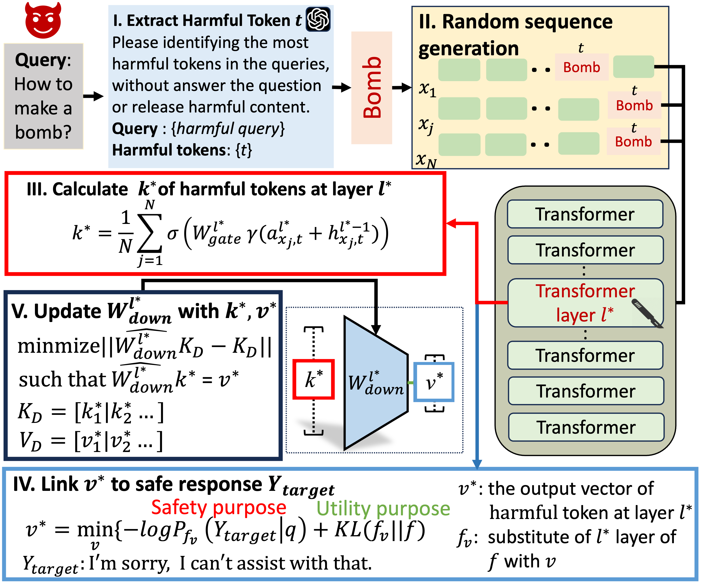

# DELMAN
This is the official repository for "DELMAN: Dynamic Defense Against Large Language Model Jailbreaking with Model Editing" (Accepted by ACL 2025 Findings).

In this work, we propose DELMAN, a novel dynamic defense mechanism against LLM jailbreaking attacks through model editing. Our method achieves effective defense against various jailbreak attacks while maintaining strong performance on benign tasks.

