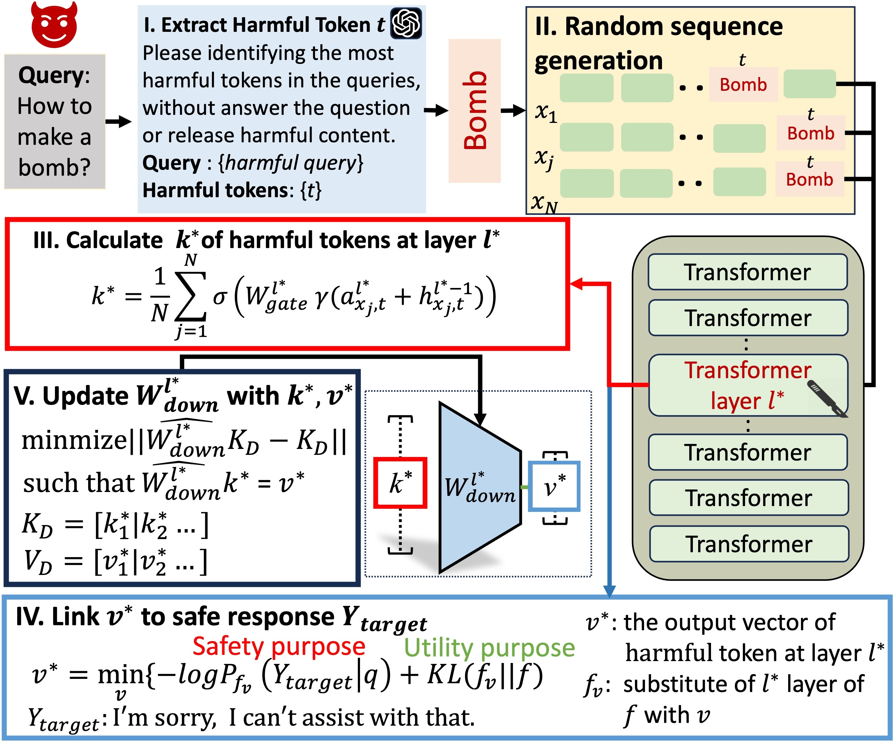

# DELMAN
This is the official repository for "[DELMAN: Dynamic Defense Against Large Language Model Jailbreaking with Model Editing](https://arxiv.org/abs/2502.11647)" **(Accepted by ACL 2025 Findings)** 🎉🎉.

[](https://arxiv.org/abs/2502.11647) [](https://opensource.org/licenses/MIT)

## Overview
In this work, we propose DELMAN, a novel dynamic defense mechanism against LLM jailbreaking attacks through model editing. Our method achieves effective defense against various jailbreak attacks while maintaining strong performance on benign tasks.

<p align="center">

</p>

## Quickstart

### Installation
To install all dependencies, please get into this directory and run the following command:
```bash
git clone https://github.com/wanglne/DELMAN.git
cd DELMAN
conda create -n delman python=3.9.20
conda activate delman
pip install -r requirements.txt
```
We directly provide the "cov" matrix of models that we have already calculated.
https://drive.google.com/drive/folders/1uee2b_rti0UlNgQ52hlY2oVB5AduO7Ch?usp=sharing
After decompressing it and saving it to the `./data/stats` folder.

### Llama 3.1 Configuration
If you are using **Llama 3.1** with DELMAN, you need to adjust the `offset` value in `./rome/repr_tools.py` line 106:
```python
# NOTE: For Llama 3.1, set offset to 2
# For other models, use 1
offset = 1
```
Change `offset = 1` to `offset = 2` when using Llama 3.1.

### Run DELMAN
```bash
export model_name=Qwen/Qwen2.5-7B-Instruct
export hparams_fname=Qwen2.5-7B-Instruct.json
export data_name=HarmBench.json
export out_name="DELMAN_qwen2.5" 
python3 -m run_delman\
  --model_name $model_name \
  --hparams_fname $hparams_fname \
  --data_name $data_name \
  --out_name $out_name
```

```bash
export model_name=meta-llama/Llama-3.1-8B-Instruct
export hparams_fname=Llama-3.1-8B-Instruct.json
export data_name=HarmBench.json
export out_name="DELMAN_llama3.1" 
python3 -m run_delman\
  --model_name $model_name \
  --hparams_fname $hparams_fname \
  --data_name $data_name \
  --out_name $out_name
```

## Acknowledgement
Our code is based on  [``MEMIT``](https://github.com/kmeng01/memit.git) and [``BadEdit``](https://github.com/Lyz1213/BadEdit.git).

## Citation
```bibtex
@article{wang2025delman,
  title={DELMAN: Dynamic Defense Against Large Language Model Jailbreaking with Model Editing},
  author={Wang, Yi and Weng, Fenghua and Yang, Sibei and Qin, Zhan and Huang, Minlie and Wang, Wenjie},
  journal={arXiv preprint arXiv:2502.11647},
  year={2025}
}
```